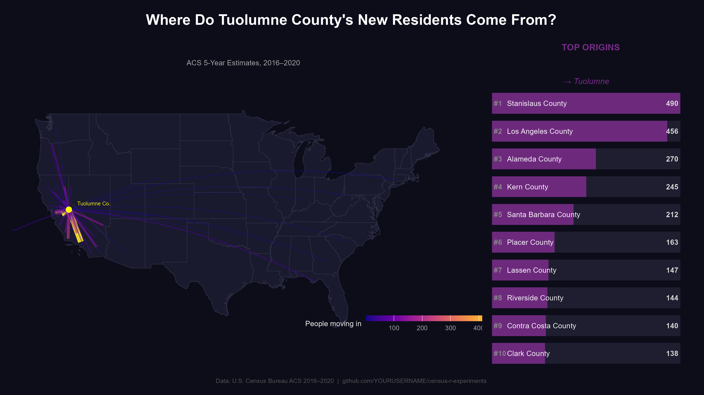
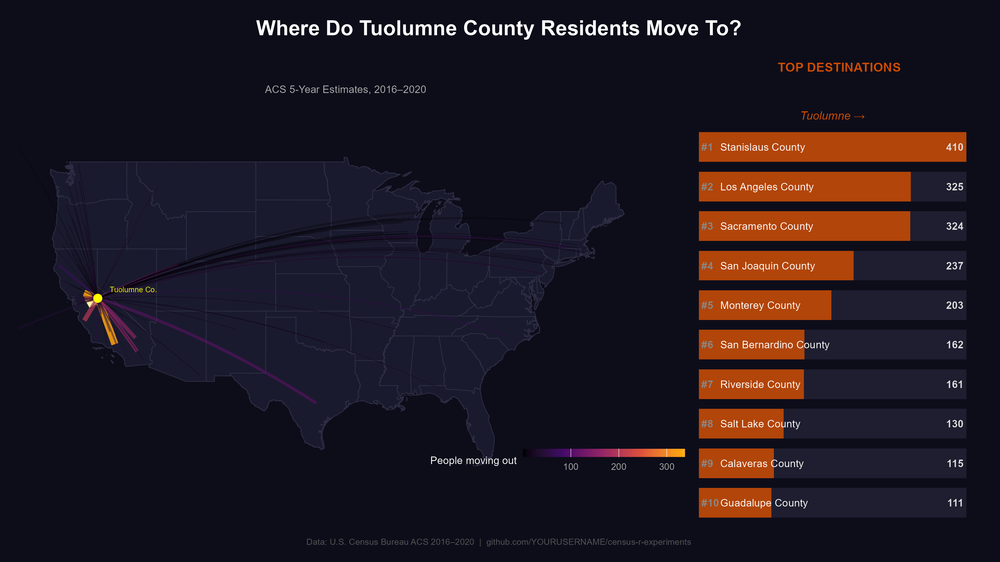
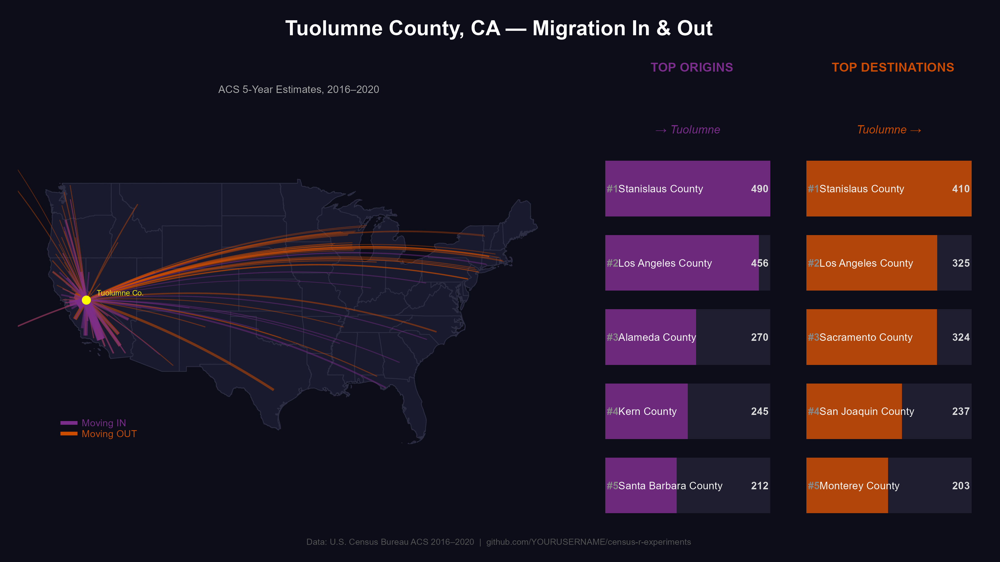
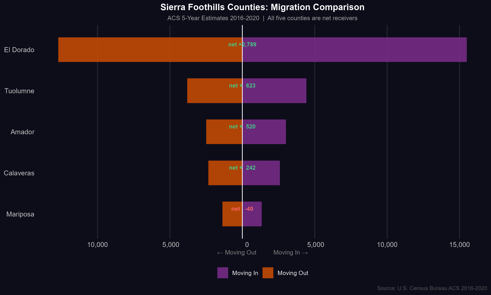
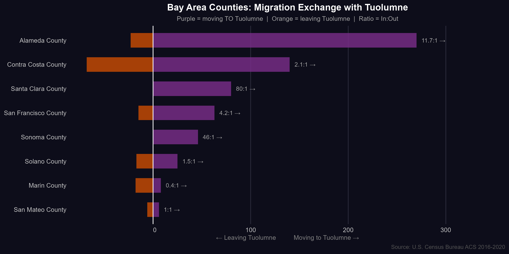
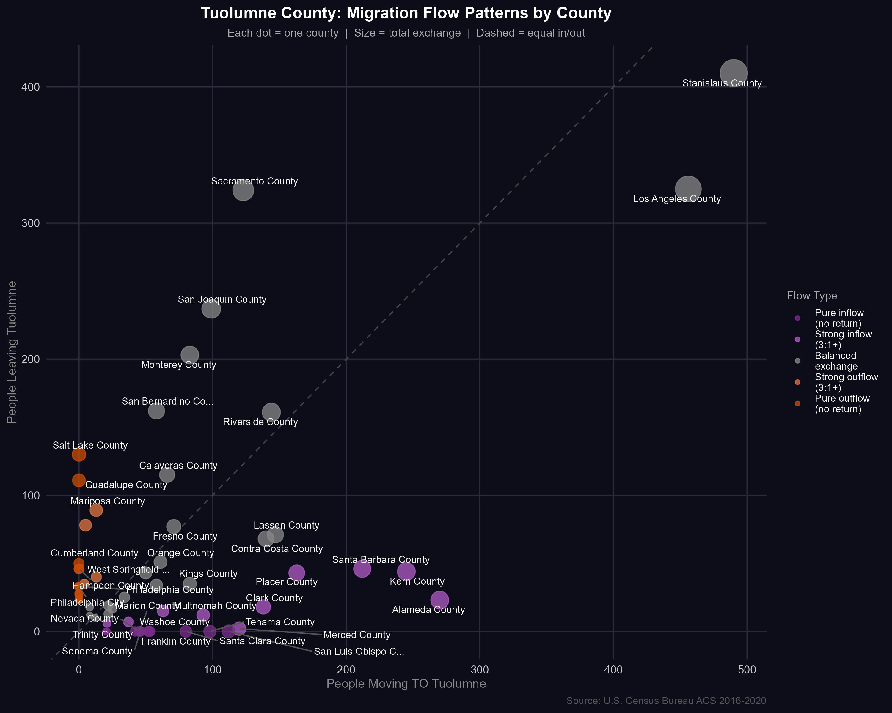
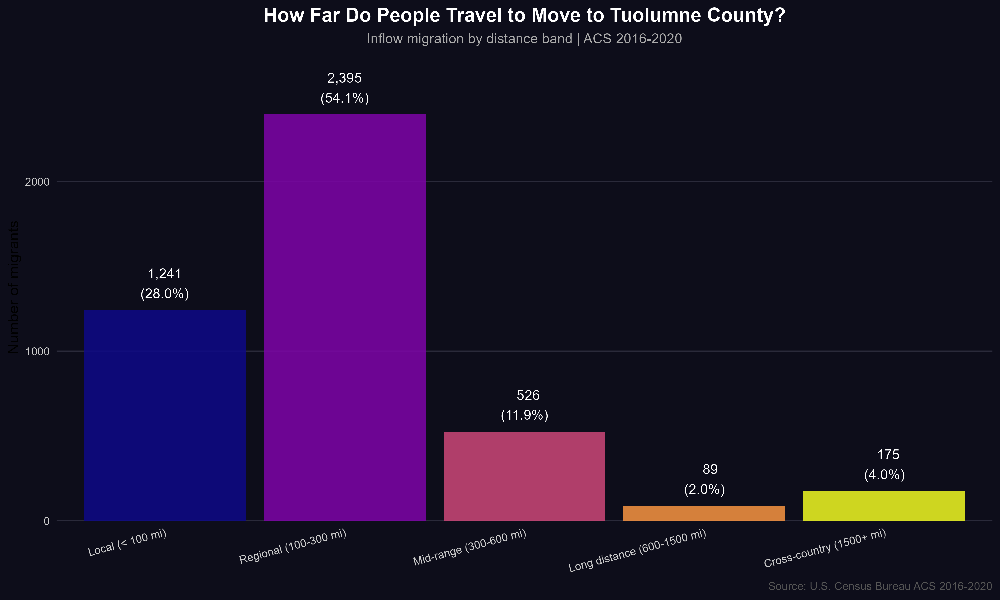
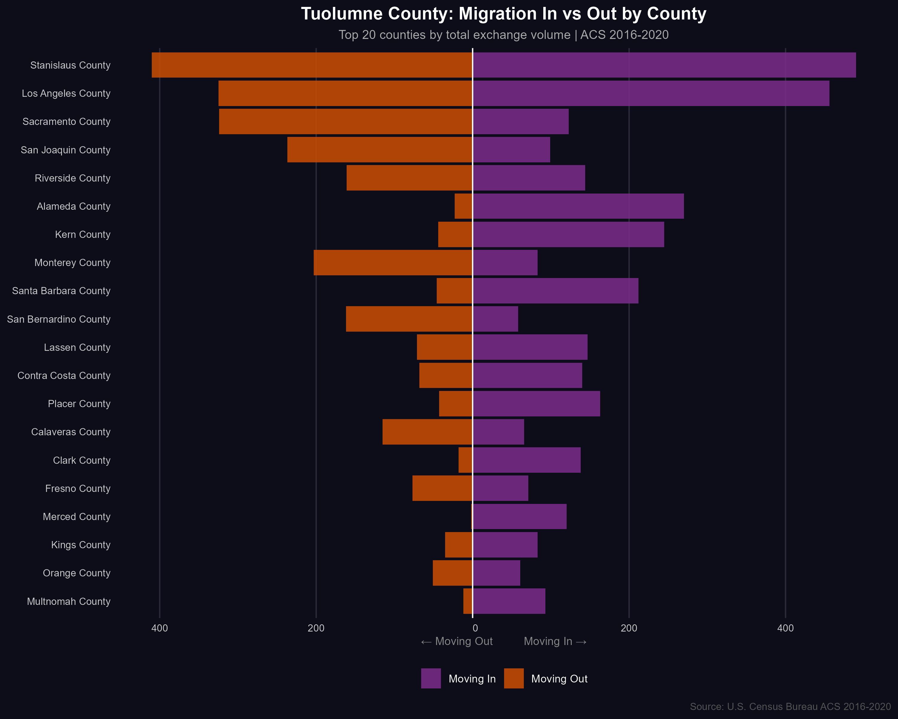

# Census R Experiments 🗺️

Exploring U.S. Census Bureau data using R —
migration flow maps, demographic analysis,
and interactive Shiny web apps.

---

## 🚀 Live Apps

| App | Description | Link |
|---|---|---|
| **Migration Explorer** | County-to-county migration flows for any US county | [brooksgroves.shinyapps.io/migration-explorer](https://brooksgroves.shinyapps.io/migration-explorer/) |
| **CA/NV Demographics** | Tract-level demographic maps for California & Nevada | [brooksgroves.shinyapps.io/ca-nv-demographics](https://brooksgroves.shinyapps.io/ca-nv-demographics/) |

---

## 📍 Project 1: Tuolumne County Migration

> *Where do people from Tuolumne County, CA go —
> and where do newcomers come from?*

Tuolumne County sits in the Sierra Nevada foothills of California,
home to Yosemite's western gateway and about 55,000 residents.
Using ACS 5-year migration flow data (2016–2020), this project maps
and analyzes the county's domestic migration patterns —
and finds some genuinely surprising stories in the numbers.

---

### The Maps

**Where do Tuolumne County's new residents come from?**



---

**Where do Tuolumne County residents move to?**



---

**Both flows together — top 5 origins and destinations:**



---

### The Numbers

| Metric | Value | Confidence |
|---|---|---|
| People moved IN (2016–2020) | 4,426 | Moderate |
| People moved OUT (2016–2020) | 3,803 | Moderate |
| **Net migration** | **+623** | Moderate |
| Counties sending people here | 62 | High |
| Counties receiving people from here | 99 | High |
| Migration within California | 86% in / 75% out | High |
| Bay Area net contribution | +491 | Moderate |
| Biggest single relationship | Stanislaus Co. (900 exchanges) | Moderate |
| Biggest net drain | Sacramento Co. (–201) | Moderate |
| Weighted avg move distance | 275 miles | Moderate |

> **A note on data quality:** 94% of individual county-level flow
> estimates carry margins of error exceeding 50% of the estimate —
> normal for small-geography ACS migration data.
> The ACS is a survey (~12% household sample), meaning small flows
> may represent just 1–2 survey respondents weighted up.
> Zero values may reflect sample gaps rather than true absence
> of migration. Directional patterns across multiple counties
> are more reliable than any single estimate.
> Thanks to [@leafyoreo](https://twitter.com/leafyoreo) for the
> sharp data quality commentary.

---

### The Stories in the Data

#### 🏔️ A Sierra-Wide Pattern

Every Sierra foothill county except Mariposa is a net migration
gainer. El Dorado County leads with +2,789 net migrants.
Tuolumne (+623) sits in the middle of the pack. This is a
regional story about California's housing costs pushing people
toward the mountains.



---

#### 🗺️ Tuolumne's Unique Geography

The only Sierra foothill county whose biggest migration relationship
is with a fellow foothill county (Stanislaus/Modesto) rather than
a major city. Every neighbor — Amador, Calaveras, El Dorado,
Mariposa — has a major metro as its top origin and destination.
Tuolumne sits in a different migration orbit.

**Neighbor county scorecard:**

| Neighbor | In | Out | Net | Verdict |
|---|---|---|---|---|
| Stanislaus | 490 | 410 | +80 | Massive churn, Tuolumne wins |
| San Joaquin | 99 | 237 | –138 | Stockton pulls people away |
| Calaveras | 66 | 115 | –49 | Neighbor wins |
| Fresno | 71 | 77 | –6 | Essentially balanced |
| Amador | 34 | 25 | +9 | Small Tuolumne win |
| Madera | 13 | 40 | –27 | Madera wins |

---

#### 🌊 The Bay Area Cash-Out

8 of 8 Bay Area counties favor Tuolumne over the reverse.
Alameda County (Oakland/Berkeley) sends nearly **12 people to
Tuolumne for every 1 who goes back**.



| County | Moved In | Moved Out | Net | Ratio |
|---|---|---|---|---|
| Alameda | 270 | 23 | +247 | 11.7:1 |
| Contra Costa | 140 | 68 | +72 | 2.1:1 |
| Santa Clara | 80 | 0 | +80 | ∞ |
| San Francisco | 63 | 15 | +48 | 4.2:1 |
| Sonoma | 46 | 0 | +46 | ∞ |
| **Total** | **638** | **147** | **+491** | **4.3:1** |

---

#### 📉 Sacramento and Stockton Pull Hardest

Despite winning against the coast, Tuolumne loses to
Sacramento (–201) and San Joaquin/Stockton (–138).
Likely younger residents seeking employment, healthcare,
and urban services in the valley below.

---

#### 🧂 The Utah/Nevada Split

Nevada **sends** people TO Tuolumne (+158 net, mostly Las Vegas).
Utah **takes** people FROM Tuolumne (–122 net, mostly Salt Lake City).
Two neighboring states, completely opposite directions.

---

#### 🎖️ The Military Pipeline

Cumberland County, NC (Fort Liberty) and Guadalupe County, TX
(near Randolph AFB) together account for
**161 departures with zero return flow** — consistent with
veterans or military families relocating near bases
after California service.

---

#### 🌋 Mariposa: The Exception

The only Sierra county losing people (–40 net). Most isolated,
smallest population. Top destination: Clark County, NV (Las Vegas).

---

#### 🔀 Flow Patterns: Every County Mapped



Each dot is one county. Above the dashed line = sends more to
Tuolumne than it receives. Below = loses more to Tuolumne
than it gains. Dot size = total exchange volume.

---

#### 📏 How Far Do People Travel?



| Distance | Migrants | Share |
|---|---|---|
| Local (< 100 mi) | 1,241 | 28% |
| Regional (100–300 mi) | 2,395 | 54% |
| Mid-range (300–600 mi) | 526 | 12% |
| Long distance (600–1,500 mi) | 89 | 2% |
| Cross-country (1,500+ mi) | 175 | 4% |

Weighted average move distance: **275 miles** —
roughly the distance from Tuolumne to the Bay Area.

---

#### 📊 In vs Out: Head to Head



---

### Migration Data Availability Note

County-to-county migration flows are released by the Census Bureau
as a **supplemental product**, typically 6–12 months after the
main ACS release. As of early 2026:

| Period | County Flows | Status |
|---|---|---|
| 2016–2020 | ✅ Available | Used in this analysis |
| 2017–2021 | ⚠️ State-level only | County flows not yet released |
| 2018–2022 | ⚠️ State-level only | County flows not yet released |
| 2019–2023 | ❌ Not available | Not yet on API |
| 2020–2024 | ❌ Not available | Not yet on API |

This project will be updated when newer county-level flows
are released. Monitor:
[tidycensus changelog](https://walker-data.com/tidycensus/news/index.html)

---

### Tuolumne Scripts

| Script | Purpose | Run Order |
|---|---|---|
| [`tuolumne_migration.R`](tuolumne-migration/tuolumne_migration.R) | Pull data, build arc lines, save maps + interactive HTML | 1st |
| [`tuolumne_migration_twitter.R`](tuolumne-migration/tuolumne_migration_twitter.R) | Twitter/X images with ranked data panels | 2nd |
| [`tuolumne_migration_explore.R`](tuolumne-migration/tuolumne_migration_explore.R) | Summary stats, distance analysis, surprise flows | 3rd |
| [`tuolumne_migration_deep.R`](tuolumne-migration/tuolumne_migration_deep.R) | MOE checks, Bay Area ratios, one-way pipelines, Sierra comparison | 4th |

**Always run `tuolumne_migration.R` first.**

---

## 🗺️ Project 2: CA/NV Demographics Explorer

> *What do the demographic patterns of California and Nevada
> look like at the census tract level —
> and what do they reveal about migration?*

A companion project to the Tuolumne migration analysis.
The migration data showed people leaving expensive coastal
California for Nevada and rural California.
This app maps the demographic patterns that help explain why.

---

### The App

**Live:** [brooksgroves.shinyapps.io/ca-nv-demographics](https://brooksgroves.shinyapps.io/ca-nv-demographics/)

**Run locally:**
```r
# Pull data first (one time, ~2 minutes)
source("ca-nv-demographics/explore.R")

# Launch app
shiny::runApp("ca-nv-demographics/shiny-demographics")
```

---

### What the Data Shows

**Education — The Two Californias**

The education map reveals California's starkest divide.
Coastal metros (Bay Area, LA, San Diego) have tract-level
bachelor's degree rates of 50–80%. The Central Valley
and inland areas sit at 10–25%. Nevada clusters around
25–35% with Las Vegas metro slightly higher.

**Rent Burden — Why People Leave**

This is the most important map for understanding migration.

| Burden Level | California Tracts | Nevada Tracts |
|---|---|---|
| Not burdened (<30%) | ~28% | ~42% |
| Cost burdened (30–50%) | ~38% | ~35% |
| Severely burdened (>50%) | ~34% | ~23% |

Over a third of California census tracts have median households
spending more than 50% of income on rent — severely burdened
by any standard. Nevada's housing costs are high but
meaningfully lower than California's coastal metros.
This cost differential directly drives the migration flows
we see in Project 1.

**Median Income — The Gradient**

California's income geography mirrors its education geography —
high on the coast, lower inland. The Bay Area has tracts with
median household incomes exceeding $200,000.
Adjacent Central Valley tracts sit below $40,000.
This gradient creates a powerful push/pull dynamic:
high-income households can cash out Bay Area equity and
buy significantly more in the foothills or Nevada.

**Recent Movers — Where People Are Actively Moving**

The "moved in past year" map shows current mobility hotspots.
High-mobility tracts cluster around Las Vegas, Sacramento suburbs,
and the Sierra Nevada foothills — consistent with the
migration flows found in Project 1.

---

### Key Features

- **Interactive legends** — drag handles to filter map by value range
- **10 variables** across education, economics, housing,
  demographics, and mobility
- **CA + NV together** or either state alone
- **Dark / Light / Voyager** basemap options
- **Quantile / Equal interval / Jenks** classification methods
- **Click any tract** for name, county, and formatted value
- **Screenshot export** — camera icon saves current view as PNG
- **County comparison table** — sortable by any variable
- **CA vs NV distribution plots** — density curves for both states
- **Rent burden story chart** — the housing cost pattern
  behind migration

---

### CA vs NV: Key Comparisons

| Variable | California (median tract) | Nevada (median tract) | Difference |
|---|---|---|---|
| Bachelor's degree | ~30% | ~23% | CA +7pp |
| Median income | ~$75,000 | ~$62,000 | CA +$13k |
| Poverty rate | ~11% | ~12% | Similar |
| Median rent | ~$1,600 | ~$1,200 | CA +$400/mo |
| Rent burden | ~38% | ~32% | CA higher |
| Owner-occupied | ~55% | ~52% | Similar |
| Median age | ~38 | ~37 | Similar |
| Foreign born | ~15% | ~10% | CA higher |
| Moved past year | ~14% | ~17% | NV more mobile |

*Values are approximate median tract-level estimates,
ACS 2018–2022.*

---

### CA/NV Scripts

| Script | Purpose |
|---|---|
| [`explore.R`](ca-nv-demographics/explore.R) | Pull ACS data, build cache, prototype maps |
| [`shiny-demographics/app.R`](ca-nv-demographics/shiny-demographics/app.R) | Main Shiny app |
| [`shiny-demographics/R/helpers.R`](ca-nv-demographics/shiny-demographics/R/helpers.R) | Formatting + palette helpers |
| [`shiny-demographics/R/map_builders.R`](ca-nv-demographics/shiny-demographics/R/map_builders.R) | Standalone map builder function |

**Run `explore.R` first** — it builds the data cache the app needs.

---

## 🗂️ Repository Structure

```
census-r-experiments/
│
├── README.md
├── .gitignore
│
├── tuolumne-migration/
│   ├── tuolumne_migration.R
│   ├── tuolumne_migration_twitter.R
│   ├── tuolumne_migration_explore.R
│   ├── tuolumne_migration_deep.R
│   └── outputs/
│       ├── *.png                        all static maps + charts
│       └── tuolumne_migration.html      interactive arc map
│
├── shiny-migration-explorer/
│   ├── app.R
│   ├── R/
│   │   ├── get_migration.R              Census API fetch + caching
│   │   ├── make_maps.R                  leaflet arc map builders
│   │   ├── make_charts.R                plotly chart builders
│   │   └── utils.R                      story generation + MOE helpers
│   └── data/
│       └── cache/                       cached API responses (gitignored)
│
└── ca-nv-demographics/
    ├── explore.R                         data pull + cache builder
    ├── shiny-demographics/
    │   ├── app.R
    │   ├── R/
    │   │   ├── helpers.R                 formatting + palette helpers
    │   │   └── map_builders.R            mapgl map builder function
    │   └── data/
    │       └── cache/                   cached tract data (gitignored)
    └── outputs/
```

---

## ⚙️ Setup

**Requirements:**
- R ≥ 4.1
- RStudio (recommended)
- Free Census API key from
  [api.census.gov](https://api.census.gov/data/key_signup.html)

**First time only:**
```r
tidycensus::census_api_key("YOUR_KEY_HERE", install = TRUE)
# Restart R after running this
```

**Install all required packages:**
```r
install.packages(c(
  # Census + spatial
  "tidycensus", "tidyverse", "sf", "geosphere",

  # Mapping
  "ggplot2", "leaflet", "mapgl",

  # Shiny
  "shiny", "bslib", "waiter", "shinyjs",

  # Charts + tables
  "plotly", "DT", "patchwork", "ggrepel",

  # Utilities
  "scales", "viridis", "htmlwidgets",
  "here", "rsconnect"
))
```

Your Census API key is stored in `.Renviron` and is
**never committed to this repo.**
Data caches are also gitignored.

---

## 🛠️ Tools & Packages

| Package | Purpose |
|---|---|
| [`tidycensus`](https://walker-data.com/tidycensus/) | Census API — `get_flows()`, `get_acs()` |
| [`mapgl`](https://walker-data.com/mapgl/) | MapLibre GL maps with interactive legends |
| [`sf`](https://r-spatial.github.io/sf/) | Spatial data handling |
| [`ggplot2`](https://ggplot2.tidyverse.org/) | Static maps and charts |
| [`leaflet`](https://rstudio.github.io/leaflet/) | Interactive arc maps |
| [`geosphere`](https://cran.r-project.org/package=geosphere) | Great circle arc geometry |
| [`patchwork`](https://patchwork.data-imaginist.com/) | Combine ggplot panels |
| [`ggrepel`](https://ggrepel.slowkow.com/) | Non-overlapping chart labels |
| [`shiny`](https://shiny.posit.co/) | Web app framework |
| [`bslib`](https://rstudio.github.io/bslib/) | Bootstrap themes for Shiny |
| [`waiter`](https://waiter.john-coene.com/) | Loading screens |
| [`plotly`](https://plotly.com/r/) | Interactive charts |
| [`DT`](https://rstudio.github.io/DT/) | Interactive data tables |
| [`shinyjs`](https://deanattali.com/shinyjs/) | JavaScript helpers |
| [`here`](https://here.r-lib.org/) | Project-relative file paths |

---

## 📊 Data Sources

**Migration flows:**
U.S. Census Bureau, American Community Survey,
County-to-County Migration Flows, 2016–2020 (5-Year Estimates).

**Tract demographics:**
U.S. Census Bureau, American Community Survey,
Data Profiles (DP02, DP03, DP04, DP05),
2018–2022 (5-Year Estimates), Census Tract Level.

Both accessed via the
[`tidycensus`](https://walker-data.com/tidycensus/)
R package by Kyle Walker.

- [ACS Migration Flows documentation](https://www.census.gov/topics/population/migration/guidance/county-to-county-migration-flows.html)
- [ACS Data Profiles documentation](https://www.census.gov/acs/www/data/data-tables-and-tools/data-profiles/)
- [tidycensus documentation](https://walker-data.com/tidycensus/)
- [Kyle Walker's Census R book](https://walker-data.com/census-r/)

---

## 📝 License

MIT — use freely, attribution appreciated.

---

*Built with R, tidycensus, and curiosity.*
*Two projects, two stories, one Census.*